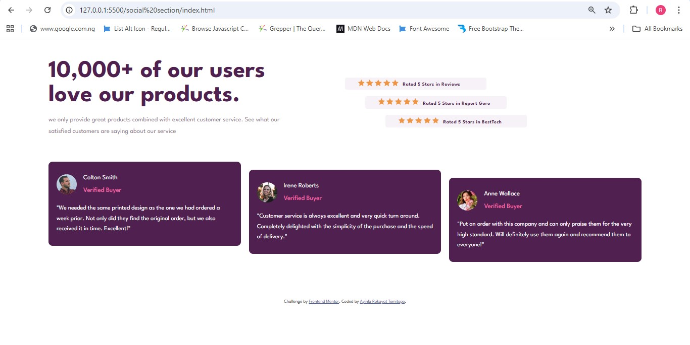

# Social-proof-section
A responsive social proof section built with HTML and CSS, featuring customer reviews and ratings. Designed with a mobile-first approach using Flexbox and Grid to ensure clean layout, scalability, and seamless adaptation across screen sizes.

# Frontend Mentor - Social proof section solution

This is a solution to the [Social proof section challenge on Frontend Mentor](https://www.frontendmentor.io/challenges/social-proof-section-6e0qTv_bA). Frontend Mentor challenges help you improve your coding skills by building realistic projects.

## Table of contents

- [Overview](#overview)
  - [The challenge](#the-challenge)
  - [Screenshot](#screenshot)
  - [Links](#links)
- [My process](#my-process)
  - [Built with](#built-with)
  - [What I learned](#what-i-learned)
  - [Continued development](#continued-development)
  - [Useful resources](#useful-resources)
- [Author](#author)
- [Acknowledgments](#acknowledgments)

## Overview

### The challenge

Users should be able to:

- View the optimal layout for the section depending on their device's screen size

### Screenshot



### Links

- Solution URL: [https://www.frontendmentor.io/solutions/social-proof-section-Wa5Ehlywvh](https://www.frontendmentor.io/solutions/social-proof-section-Wa5Ehlywvh)
- Live Site URL: [https://socialproofsectionrukkiea.netlify.app/](https://socialproofsectionrukkiea.netlify.app/)

## My process

### Built with

- Semantic HTML5 markup
- CSS custom properties
- Mobile-first workflow
- Flexbox
- CSS Grid
- Media queries for responsive layouts

### What I learned

Working on this project helped reinforce the importance of starting with a **mobile-first approach** and progressively enhancing the layout for larger screens. I also gained more confidence combining **Flexbox and CSS Grid** in the same project to solve different layout problems effectively.

I learned how small layout shifts—such as staggered cards and offset rating sections—can significantly improve visual hierarchy and user experience on desktop screens.

Example of responsive layout handling using CSS Grid:

```css
.customer-review-section {
  display: grid;
  grid-template-columns: auto auto auto;
}
```

### Continued development

In future projects, I want to continue focusing on:
Improving accessibility (ARIA roles and better semantic structure)
Writing more scalable and reusable CSS
Exploring CSS utility patterns and modern layout techniques
Enhancing responsiveness for very large screens

### Useful resources

- Frontend Mentor – Great platform for practicing real-world frontend layouts

- MDN Web Docs – Helpful reference for HTML and CSS concepts

- CSS Tricks – Flexbox & Grid Guides – Excellent visual explanations of layout techniques

### Author

Website – Your Name
Frontend Mentor – @yourusername
Twitter – @yourusername

### Acknowledgments

Thanks to Frontend Mentor for providing well-structured challenges that encourage best practices and continuous learning in frontend development.
